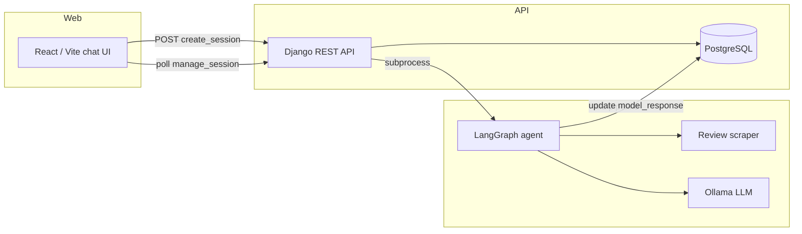

# Auto Product Insights Generator (ProdInsight)

Auto Insighter is a full-stack product insights application. Users submit a product name (and optionally a document) through a React chat UI. A Django REST API stores the request, launches an AI pipeline in the background, scrapes public reviews from the web, and returns structured analysis—pros, cons, rating, places to fix, and recommendations—powered by Ollama and LangGraph.

## Architecture



## Repository layout

```
project2/
├── apps/
│   ├── api/app/myApp/          # Django project and REST API
│   │   ├── app_views/          # Chats model, serializers, views, URLs
│   │   └── myApp/              # settings, root URLs, WSGI/ASGI
│   ├── scrapper/               # DuckDuckGo + Reddit/Quora review scraper
│   └── web/
│       ├── home_page/          # Landing pages (HTML/CSS) and React app
│       └── get_started_page/   # About, tutorial, contact static pages
├── models/
│   ├── agents/                 # LangGraph workflow (main runtime pipeline)
│   └── trained/                # BERT-tiny sentiment training script/notebook
├── vector_stores/              # Chroma persistence for embeddings
├── requirements.txt            # Python dependencies for the whole project
└── README.md
```

## Features

- **Chat-style UI** (`ProdInsight`): enter a product name, attach optional PDF/DOCX/TXT files, and poll until the model response is ready.
- **REST API**: create, list, read, update, and delete chat sessions backed by PostgreSQL.
- **Review aggregation**: searches general reviews, Reddit threads, and Quora discussions via DuckDuckGo; extracts comment text where possible.
- **Structured AI analysis**: a two-step LangGraph flow (`validate` → `fix`) uses Ollama (`llama3.1`) with structured outputs for flaws, strengths, rating, fixes, and recommendations.
- **Optional document context**: uploaded files are stored under `apps/api/app/myApp/Cache/` and can be loaded into the agent pipeline.
- **Sentiment training** (separate): `models/trained/` fine-tunes a tiny BERT model on review-style data and saves weights under `models/weights/`.

## Prerequisites

- **Python** 3.11+ (project uses Django 5.2)
- **Node.js** 18+ (for the React frontend)
- **PostgreSQL** running locally with a database named `chats` (see `apps/api/app/myApp/myApp/settings.py`)
- **Ollama** with the any required ollama model

Update database credentials in `apps/api/app/myApp/myApp/settings.py` before running the API.

## Installation

From the repository root (`project2`):

```bash
python -m venv .venv
.venv\Scripts\activate          # Windows
# source .venv/bin/activate     # macOS/Linux

pip install -r requirements.txt
```

### Frontend (React)

```bash
cd apps/web/home_page/home_page_new
npm install
```

## Running the application

### 1. Start PostgreSQL

Ensure PostgreSQL is running and the `chats` database exists. Adjust `DATABASES` in `myApp/settings.py` if your user, password, or host differ.

### 2. Migrate and run the API

```bash
cd apps/api/app/myApp
python manage.py migrate
python manage.py runserver
```

The API listens at `http://127.0.0.1:8000/`.

### 3. Start Ollama

```bash
ollama serve
ollama pull model_name
```

### 4. Start the React UI

```bash
cd apps/web/home_page/home_page_new
npm run dev
```

Open the Vite dev URL (typically `http://localhost:5173`). The chat component calls `http://127.0.0.1:8000/` for API requests.

### 5. Run components manually (optional)

**Review scraper only:**

```bash
python apps/scrapper/review_scraper.py
```

**Agent pipeline only** (requires Django DB with at least one `Chats` row):

```bash
python models/agents/model.py
```

**Train sentiment model:**

```bash
python models/trained/model.py
```

Background agent runs also append logs to `model_subprocess.log` at the project root when triggered from the API.

## API endpoints

| Method | Path | Description |
|--------|------|-------------|
| `POST` | `/create_session/` | Create a chat row; starts `models/agents/model.py` in a subprocess |
| `GET` | `/sessions/` | List all sessions |
| `GET` | `/manage_session/<id>/` | Retrieve one session (used for polling `model_response`) |
| `PUT` / `PATCH` / `DELETE` | `/manage_session/<id>/` | Update or delete a session |
| — | `/admin/` | Django admin |

### Create session body (multipart)

| Field | Type | Description |
|-------|------|-------------|
| `human_query` | string | Product name to analyze |
| `uploaded_file` | file (optional) | PDF, DOCX, or TXT for extra context |

`model_response` starts as `"Loading..."` and is updated by the agent subprocess when analysis completes.

## Data model

**`Chats`** (`app_views`):

- `human_query` — product name / user query  
- `model_response` — JSON-encoded formatted report or `"Loading..."`  
- `uploaded_file` — optional file in `Cache/`  
- `time` — auto timestamp  

## Static marketing pages

Under `apps/web/get_started_page/` and `apps/web/home_page/primitive/`:

- Home, about, tutorial, and contact pages (HTML/CSS)
- Older primitive landing page styles

The main interactive experience is the Vite React app in `apps/web/home_page/home_page_new/`.

## Environment and security notes

- Do not commit production secrets. Replace the default `SECRET_KEY` and database password in `settings.py` for deployment.
- CORS is currently open (`CORS_ALLOW_ALL_ORIGINS = True`) for local development; restrict origins in production.
- The agent script uses a hardcoded cache path in `models/agents/model.py`; align it with your machine or make it relative to the project if you move the repo.

## Tech stack summary

| Layer | Technologies |
|-------|----------------|
| Frontend | React 19, Vite 8 |
| API | Django 5.2, Django REST Framework, django-cors-headers |
| Database | PostgreSQL |
| Scraping | requests, BeautifulSoup, ddgs |
| AI / ML | LangGraph, LangChain, Chroma, Ollama, PyTorch, Hugging Face Transformers, PEFT |

## License

No license file is included in this repository; add one if you plan to distribute the project.
